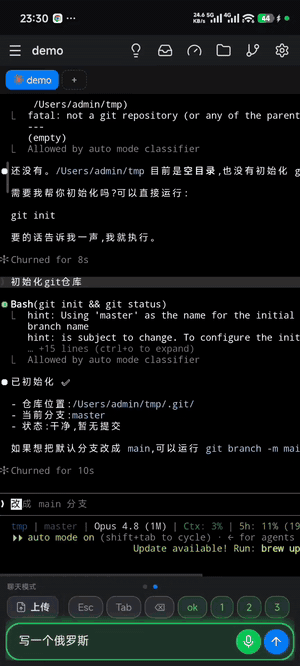
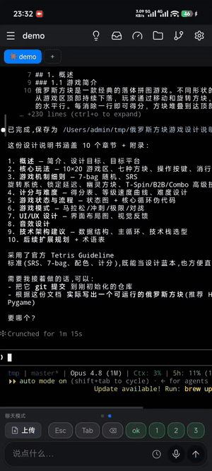

<p align="center"></p>

<p align="center">🌐 <a href="README.md">English</a> &nbsp;·&nbsp; 🇨🇳 <b>中文</b></p>

<p align="center"><a href="https://handmux.com"><b>handmux.com</b></a></p>

<p align="center">
  <a href="https://www.npmjs.com/package/handmux"></a>
  <a href="https://github.com/handmux/handmux/actions/workflows/test.yml"></a>
  <a href="LICENSE"></a>
  <a href="https://nodejs.org"></a>
</p>

> **一部手机,一整套移动 Vibe Coding 驾驶舱。** 基于 tmux——电脑上一行命令、手机扫码,你正跑着的会话、Claude Code、Codex、git、预览、文档全到手里,创造力随时随地都在你手上。

handmux 不只是把终端搬上手机。它把你电脑上**正跑着的 tmux 会话**原样搬进手机浏览器(同一个真实 pane,不是只读镜像),再围着它搭起一整套**移动 Vibe Coding 驾驶舱**:**Claude Code / Codex** 要你拍板时推到手机、拇指一点就批,动动嘴就发新指令;**git** 全屏看彩色 diff;一键**预览**正跑着的网站;**文档**逐句朗读;文件随手双向传。手机端**零安装**——点开链接就进去,"添加到主屏"即成全屏 **PWA**,和原生 App 基本无异。窝在沙发、挤在地铁,Vibe Coding 不停,创造力随时在你手里。

<p align="center">
  
  &nbsp;&nbsp;
  
  <br>
  <em>真实手机浏览器、真实 pane——左:说出需求,Claude Code 直接写好,点文件名即可预览;右:需要你时推送提醒,查看 git 仓库与各 agent 用量。</em>
</p>

**[📖 文档](https://handmux.com/docs)** · **[📝 更新日志](CHANGELOG.md)** · **[📦 npm](https://www.npmjs.com/package/handmux)**

## 快速上手 · 约一分钟

**电脑上**需要 tmux 和 Node ≥ 18(手机只要个浏览器)。二选一:

**Homebrew —— macOS 首选** · 顺带帮你装好 Node + tmux:

```bash
brew install handmux/tap/handmux
```

**npm —— 任意平台** · 若你已经有 Node:

```bash
npm i -g handmux
```

然后跑起来:

```bash
handmux start        # 仅本机 / 同 wifi,不对外暴露
```

`start` 会打印一个**二维码**(外加地址和 token)。**手机扫它**——token 在码里,首次打开即登录。你会看到自己真实的 tmux 会话,点一个就开始操作。

想从**任何地方**都连得上?加一个参数开一条免费公网 HTTPS 链接:

```bash
handmux start --tunnel cloudflare   # 即时公网地址(自动装 cloudflared)
```

> 隧道类型、自建、Windows/WSL2、完整命令与参数 → 见 **[文档](https://handmux.com/docs)**。

## 为什么是 handmux

- **🧰 不只是终端——一整套装进口袋的移动 Vibe Coding 驾驶舱。** git 全屏看彩色 diff、一键预览正跑着的网站、文档逐句朗读、文件随手双向传——一整套开发能力,此刻全套在手,不用在几个 App 间来回切。
- **🚀 一分钟从零到手机上敲代码。** 一条 `handmux start`、扫个码,完事——不注册、不上应用商店、不装 App,一个链接就进去。"添加到主屏"后即为全屏 **PWA**,和原生 App 一样顺手。
- **🧶 人走,活不停。** 手机连的是你工位上**那一个**正跑着的 tmux pane(不是新 shell、不是截图)。合上电脑,拇指接着盯,状态一点不差。
- **🔔 需要你时,手机会响。** Claude Code / Codex 一到要你拍板就推送;添加到主屏后直接走系统通知。收件箱标「进行中 / 需要你 / 已完成」,多项目并行状态一览无余,拇指一点批授权批计划,别再守着屏幕等它。
- **🔒 你的代码,不经过任何中转。** 免费、完全开源;我们没有中转服务器,数据只在你的电脑和手机之间直接走,确保安全。

## 功能一览

- **Claude Code / Codex 深度**——收件箱状态台账、拇指批授权批计划、各 agent 用量条。
- **对话视图（实验性）**——把 Claude 会话当成聊天来看、来驱动,而不是终端:气泡 + Markdown 正文、带彩色 diff 的工具卡、点按即答的问题卡、暖色配色。实验性功能,可能不稳定:在设置里开启「启用对话视图(实验性功能)」后,从窗口栏切换视图。
- **命令 / 聊天双模式**——底部一栏两种模式:直接敲进终端,或用自然语言发给 agent。`handmux shortcuts` 可直接添加按键或文字,文字明确是否回车,排序时可一次移动到任意位置;手机仍可在 ⚙ 面板增加和编辑本机项。修改会立即应用到正在运行的 server,手机每次回到前台自动读取,无需重启或轮询。
- **脚本推送**——用 `handmux push` 从脚本或 CI 步骤推消息到手机,可指定全部设备、某个会话或某台设备。
- **工作区恢复**——handmux 静默保存重建最新 tmux 工作区所需的元数据。电脑或 tmux server 重启后,可从手机或 `handmux restore` 把旧工作区恢复到新会话旁边,绝不替换现有会话。
- **Git 查看器**——改动 / 提交历史 / 任意分支 / 全屏彩色 diff,多仓库分页,只读不动工作区。
- **站点预览**——挑目录预览静态站,或按端口预览正跑的 HTTP/HTTPS 服务(路由 / 接口 / HMR 全保留)；动态预览域名在 `handmux setup` 里一次配好即可。
- **文档**——终端里点路径即开;Markdown 排版、字号缩放、逐句高亮朗读。
- **选中 · 拷贝**——终端里长按选中,拖 iOS 式手柄精调,一键拷贝选区 / 整行 / 整段。
- **文件双向传**——聊天框多选上传、下载、系统分享进来、复制绝对路径。
- **想法 · 随想随记**——不错过任何点子:每窗口一份想法清单,灵感一冒就记(能语音速记),一点填进输入框。
- **专治弱网**——退避重连、掉线横幅、离线兜底页、后台暂停轮询;光标不乱跳。
- **零安装 PWA**——浏览器直接跑,可加主屏全屏运行;多语言(English、简体 / 繁體中文、日本語、한국어)。

## 工作区恢复

handmux 会持续维护最新工作区元数据的两份容灾副本。它们不是操作历史:日常变动和 handmux 能确认的主动删除只会更新当前状态。只有电脑或 tmux 环境换代时才归档可选择的 checkpoint。若最后一个 tmux 会话在 handmux 外消失，tmux 无法区分主动删除与崩溃；为保留崩溃恢复能力，handmux 会保留最后状态。最近 24 小时内的全部保留;更早历史再裁到最新 10 份,最新有效 checkpoint 不会只因过期而消失。

重启后若 checkpoint 里还有内容待恢复,手机会在一小时内显示「恢复上次工作区」;若 tmux 当前没有任何会话,则直接打开确认弹窗。在手机上忽略后,该 checkpoint 只在这台手机上不再提示。恢复完成后会汇总实际恢复的会话、窗口和窗格,但不会自动打开或绑定;需要时可点「重新绑定会话」选择要显示在这台手机上的会话。手机提示过期后,CLI 仍一直可用:

```bash
handmux restore --dry-run                         # 预览最新恢复计划
handmux restore                                  # 恢复;TTY 交互选择,非 TTY 用最新
handmux restore --list                           # 列出保留的 checkpoint
handmux restore --checkpoint <id> --session api  # 选历史 / 只恢复一个会话
```

恢复是只新增、可重复执行的:不会停止、改名、替换或改变当前会话的拓扑;同名时依次改为 `name-restored`、`name-restored-2`。在安全可表达的范围内重建窗口、窗格、工作目录和布局。只有经过验证的 Claude Code / Codex 会话会用已持久化的 session ID 续接;普通 pane 只在原目录打开 shell,不会重放命令或保存的终端输出。元数据位于 `~/.handmux/workspaces/`,可能包含路径、tmux 名称/布局和 agent session ID,但不包含 pane 输出。

## 脚本推送

在电脑上运行任意脚本、CI 步骤或构建钩子时,推送通知到手机:

```bash
handmux push "构建完成" "耗时 3m12s"
```

在**你的电脑上**直接对正在运行的 `handmux` 服务器执行(回环 + 本地服务器 token——无需配置,无远端端点)。需先通过 `handmux setup` 启用 Web Push。

**语法**

```
handmux push <title> <body> [选项]
```

| 参数 | 说明 |
|---|---|
| `--session <name>` | 仅推送到订阅了该 tmux 会话的设备(可重复使用,支持逗号分隔) |
| `--device <key>` | 仅推送到指定 key 的设备(可重复使用,支持逗号分隔) |
| `--tag <T>` | 通知标签(合并同类通知) |
| `--url <U>` | 点通知后打开的 HTTP(S) URL 或站内相对路径 |

**推送范围——三选一:**

- _(默认)_ — 全部已订阅设备
- `--session` — 仅订阅了指定会话的设备
- `--device` — 仅指定 key 的设备

`--session` 与 `--device` 互斥。

**设备 key** 在手机 App 的设置 → 脚本推送中查看。它是寻址标识符,不是密钥——安全边界是本地服务器 token。

> **可靠性说明:** Web Push 属于尽力投递,不保证实时送达。有投递强要求的告警请使用专用 IM(微信、钉钉等)。

## 联网:一句话决策

默认不开隧道——手机**直连你自己的电脑**,什么都不暴露、也没有中间人。想从外面连,只问一句:**电脑有没有公网地址?**

- **有**(云主机 / 公网 IP / 已端口转发)—— 不用隧道,直接连,最快也最私密。
- **没有** —— 开一条隧道。每条都跑在**你自己的免费第三方账号**上,handmux 只负责接通、自身不设中转:`cloudflare`(零配置秒通,但公共边缘在国内常不稳)· `cloudflare-named`(你的域名,更稳)· `natapp` / `cpolar`(国内厂商,大陆境内可达)· `ssh` 自建(接你自己的服务器)。

> 隧道配置、服务端反向代理、开机自启、语音 / 推送凭证、端口预览等细节 → 见 **[文档](https://handmux.com/docs)**。

安装开机自启后，`handmux start` / `stop` / `restart` 会始终与同一个 launchd/systemd 服务协同（升级后也一样）。生命周期锁会阻止并发启动；`status` 显示实际运行版本，并列出未登记/重复 supervisor 的 PID；`stop` 会回收全部副本。

## 环境要求

电脑需 **Node ≥ 18** 与 **tmux ≥ 3.0**;手机只要浏览器。**Windows** 请装进 **WSL2**(真 Linux 内核 + 真 tmux)——见 [文档](https://handmux.com/docs#windows)。

## 反馈与交流

遇到 bug、或者希望 handmux 多干点什么?[**发个 Issue**](https://github.com/handmux/handmux/issues)——这是真正会被跟踪处理的渠道(中英文都行)。也欢迎加入**用户微信群**,反馈直达、用法交流:


## 更多

**[📖 文档](https://handmux.com/docs)** · **[📝 更新日志](CHANGELOG.md)** · **[🔒 安全](SECURITY.md)** · 许可证 **AGPL-3.0**

发现安全问题请私下报告(见 [SECURITY.md](SECURITY.md)),别开公开 issue。
