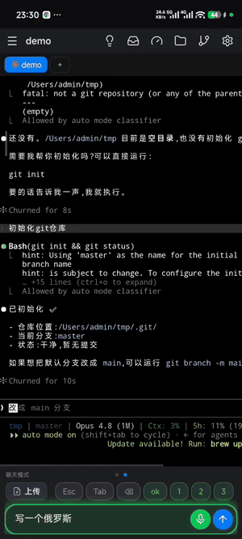
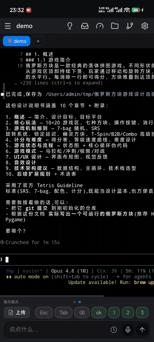

<p align="center"></p>

<p align="center">🌐 <a href="README.md">English</a> &nbsp;·&nbsp; 🇨🇳 <b>中文</b></p>

<p align="center"><a href="https://handmux.com"><b>handmux.com</b></a></p>

<p align="center">
  <a href="https://www.npmjs.com/package/handmux"></a>
  <a href="https://github.com/handmux/handmux/actions/workflows/test.yml"></a>
  <a href="LICENSE"></a>
  <a href="https://nodejs.org"></a>
</p>

> **一部手机,一整套移动 Vibe Coding 驾驶舱。** 基于 tmux——电脑上一行命令、手机扫码,你正跑着的会话、Claude Code、Codex、git、预览、文档全到手里,创造力随时随地都在你手上。

handmux 把电脑上的**同一个实时 tmux 工作区**带到手机或桌面浏览器。你可以继续使用 Claude Code、Codex、Pi 或任何终端工具，查看改动、处理确认、预览应用和传输文件，而不用另开一套远程会话。它完全开源、自托管，手机无需安装 App，也无需注册 handmux 账号。

<p align="center">
  
  &nbsp;&nbsp;
  
  <br>
  <em>真实手机浏览器、真实 pane——左:说出需求,Claude Code 直接写好,点文件名即可预览;右:需要你时推送提醒,查看 git 仓库与各 agent 用量。</em>
</p>

**[📖 文档](https://handmux.com/docs)** · **[🧭 路线图](ROADMAP.md#中文)** · **[📝 更新日志](CHANGELOG.md)** · **[📦 npm](https://www.npmjs.com/package/handmux)**

## 快速上手 · 约一分钟

**电脑上**需要 tmux 和 Node ≥ 22.16(手机只要个浏览器)。二选一:

**Homebrew —— macOS 首选** · 顺带帮你装好 Node + tmux:

```bash
brew install handmux/tap/handmux
```

**npm —— 任意平台** · 若你已经有 Node:

```bash
npm i -g handmux
```

然后跑起来:

```bash
handmux start        # 仅本机 / 同 wifi,不对外暴露
```

`start` 会打印一个**二维码**(外加地址和 token)。**手机扫它**——token 在码里,首次打开即登录。你会看到自己真实的 tmux 会话,点一个就开始操作。

想从**任何地方**都连得上?加一个参数开一条免费公网 HTTPS 链接:

```bash
handmux start --tunnel cloudflare   # 即时公网地址(自动装 cloudflared)
```

> 隧道类型、自建、Windows/WSL2、完整命令与参数 → 见 **[文档](https://handmux.com/docs)**。

## 为什么是 handmux

- **🧶 同一个工作区，到处继续。** 手机操控的是电脑上正在运行的真实 tmux pane，不是截图，也不是另一套云端会话。
- **🔔 不必守着 Agent。** 随时查看哪些 pane 正在工作或等你处理，需要时收到通知并在手机上确认。
- **🧰 完整的移动开发驾驶舱。** 终端、Agent 对话、Git、预览、文档、文件、用量和想法收集集中在一起。
- **🔒 天生自托管。** 浏览器连接你自己的电脑，中间没有 handmux 账号服务或中转服务器。

## 功能一览

- **实时终端**——手机和电脑操控同一个 tmux pane，支持历史记录、物理键盘输入和原生复制粘贴。
- **Agent 对话**——以流式对话操作 Codex；可选的 Claude Code 与 Pi 接入也能在支持的对话流程里使用同一个工作区。
- **收件箱与确认**——集中查看多个 pane、接收推送，并远程处理权限或计划确认。
- **Git 与预览**——查看仓库，并从浏览器打开运行中的网站、内网页面或静态目录。
- **文档与文件**——打开可读文件、听文档朗读，并双向上传、下载或分享文件。
- **想法与语音**——按窗口保存想法，并通过支持的讯飞或腾讯识别模式输入文字。
- **用量概览**——查看支持的 Agent 订阅额度和已配置 API 服务商余额，完整密钥不会返回浏览器。
- **会话韧性**——弱网下自动恢复连接，电脑重启后可恢复已保存的 tmux 工作区结构。
- **脚本推送**——通过 `handmux push` 从本地脚本或 CI 向手机发送通知。
- **零安装 PWA**——添加到主屏即可全屏使用，支持中文、English、日本語和 한국어。

## Agent 接入

Codex 接入已内置；Pi 和 Claude Code 接入可按需开启：

```bash
handmux codex [args...]
handmux pi [args...]
handmux agent enable pi
handmux agent enable claude
```

状态、关闭、兼容和 reload 行为见 **[Agent 接入文档](https://handmux.com/docs#cmd-agent)**。

## 连接方式

默认由浏览器直连你自己的电脑。离开家庭或办公网络时，可使用公网地址，或通过自己的 Cloudflare、natapp、cpolar、SSH 配置建立隧道。详见 **[连接文档](https://handmux.com/docs#tunnels)**。

## 环境要求

电脑需 **Node ≥ 22.16** 与 **tmux ≥ 3.0**;手机只要浏览器。**Windows** 请装进 **WSL2**(真 Linux 内核 + 真 tmux)——见 [文档](https://handmux.com/docs#windows)。

## 反馈与交流

遇到 bug、或者希望 handmux 多干点什么?[**发个 Issue**](https://github.com/handmux/handmux/issues)——这是真正会被跟踪处理的渠道(中英文都行)。也欢迎加入**用户微信群**,反馈直达、用法交流:


## 更多

**[📖 文档](https://handmux.com/docs)** · **[🧭 路线图](ROADMAP.md#中文)** · **[📝 更新日志](CHANGELOG.md)** · **[🔒 安全](SECURITY.md)** · 许可证 **AGPL-3.0**

发现安全问题请私下报告(见 [SECURITY.md](SECURITY.md)),别开公开 issue。
